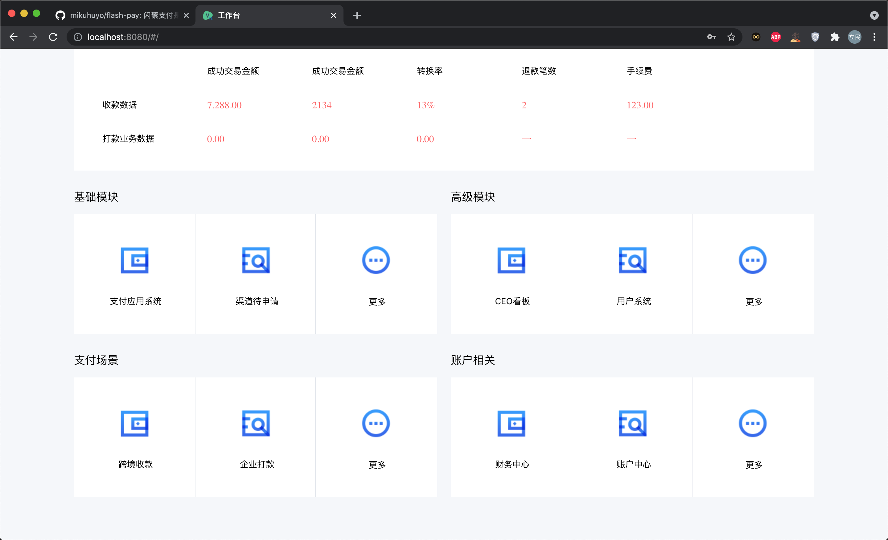
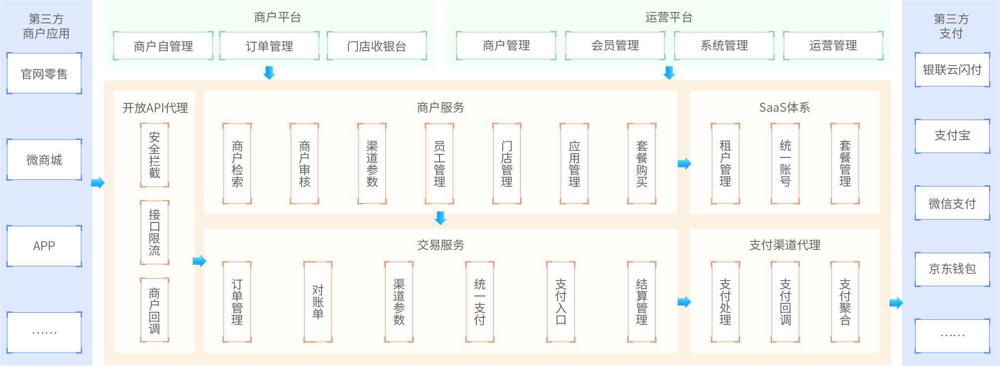
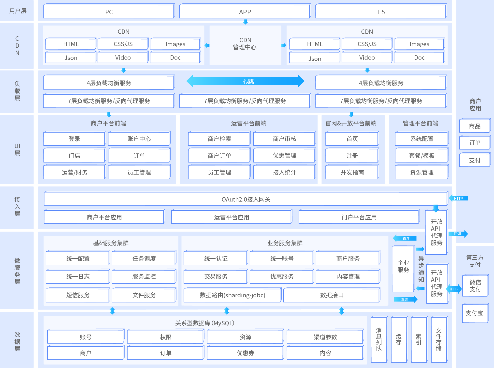

# 闪聚支付(FlashPay|ShanJuPay)

## 前言

这个闪聚支付还是我的一个学习项目, 不得不说抄代码能学会很多东西 :)

项目中并没有使用分库分表插件, 个人的学习项目我感觉不需要太多的技术点.

Ps: 万万没想到写文档和注释是这么痛苦.

所需技术点:

1)SpringBoot

2)SpringCloud

3)SpringCloudAlibaba

4)Vue&ES6

5)MySQL

6)Redis

7)RocketMQ

8)Oauth2

所需工程:

| 工程          | 说明           | 地址                                    |
| ------------- | -------------- | --------------------------------------- |
| `tencent-sms` | 腾讯云短信服务 | https://github.com/mikuhuyo/tencent-sms |
| `minio`       | 图片上传服务   | https://github.com/mikuhuyo/minio       |

## 项目预览

## 项目介绍

### 亮点

- 采用Spring Security OAuth2 + JWT + Gateway 实现微服务架构的统一认证, 商户, 平台运营用户均采用统一的认证机制.
- 采用Redis缓存方案, 对支付渠道参数全面缓存提高支付交易性能.
- 采用云平台对象存储, 存储平台资质文件提高分布式存储性能.
- 采用Sharding-Jdbc实现分库分表对订单表进行拆分, 提高关系数据库的存储性能.
- 采用服务代理机制, 解决内部微服务与第三方服务的耦合性.

### 背景

随着移动支付的盛行, 商业银行, 第三方支付公司, 其它清算机构, 消费金融公司等众多类型的机构, 都在为商户提供网络(移动)支付解决方案.

另一方面, 用户的支付需求繁多, 支付渠道已呈"碎片化"状态, 并且"碎片化"程 度将逐渐加深. 聚合支付顾名思义就是将目前主流的支付进行整合, 形成第三方支付的聚合通道, 也被称为"第四方支付".

聚合支付不进行资金清算, 因此无需支付牌照, 其只是完成支付环节的信息流转和商户运营的承载, 其在集合银联, 支付宝, 微信等主流支付方式的基础上, 帮助商户降低接入成本, 提高运营效率, 具有中立性, 灵活性, 便捷性等特点.

### 概述

闪聚支付是一个提供聚合支付的平台, 聚合支付目前主要的做法就是线上聚合收银台(开放API), 线下C2B一码多付, 线下B2C商家扫码.

平台应以SaaS服务形式提供给各商户订单管理, 门店管理, 财务数据统计等基础服务, 闪聚支付还以支付为入口, 通过广告, 营销, 金融等服务, 构建一个移动支付的全生态系统.

## 技术架构

### 功能架构

### 技术架构

 

## 技术选型

### 后端

| 技术                 | 说明                |
| -------------------- | ------------------- |
| SpringBoot           | 容器+MVC框架        |
| SpringCloud&SpringCloudAlibaba | 微服务 |
| SpringSecurity Oauth2 | 认证和授权框架      |
| MyBatisPlus              | ORM框架             |
| Swagger-UI           | 文档生产工具        |
| Redis                | 分布式缓存          |
| Docker               | 应用容器引擎        |
| MinIO                | 对象存储            |
| SpringTask | 任务调度 |
| RocketMQ | 消息中间件 |
| ShardingSphere | 分库分表中间件 |
| ... | ... |

### 前端

| 技术       | 说明             |
| ---------- | ---------------- |
| Vue        | 前端框架         |
| Vue-router | 路由框架         |
| Vuex       | 全局状态管理框架 |
| Element    | 前端UI框架       |
| Axios      | 前端HTTP框架     |
| ...        | ...              |

## 开发相关

> 开发机器: MacBookPro 2015 (16GB + 256 GB)

### 开发工具

| 工具          | 说明                |
| ------------- | ------------------- |
| IDEA          | 开发IDE             |
| RedisDesktop  | redis客户端连接工具 |
| Robomongo     | mongo客户端连接工具 |
| SwitchHosts   | 本地host管理        |
| Navicat       | 数据库连接工具      |
| PowerDesigner | 数据库设计工具      |
| Axure         | 原型设计工具        |
| MindMaster    | 思维导图设计工具    |
| ProcessOn     | 流程图绘制工具      |
| Snipaste      | 屏幕截图工具        |
| Postman       | API接口调试工具      |
| Typora        | Markdown编辑器      |

### 开发环境

| 工具          | 版本号 |
| ------------- | ------ |
| JDK           | 11  |
| MySQL      | 5.7    |
| Redis         | 4    |
| RocketMQ      | 4.4.0 |
| Nginx         | 1.10   |
| Nacos | 1.3.1 |

## 启动项目

> 环境搭建此处就不在做过多说明

### 启动类

| 启动顺序 | 启动类                          | 说明         |
| -------- | ------------------------------- | ------------ |
| `1`      | `MonitorServiceApplication`     | 监控服务     |
| `2`      | `GatewayBootstrap`              | 网关服务     |
| `3`      | `UaaBootstrap`                  | 认证服务     |
| `4`      | `UserBootstrap`                 | 统一用户服务 |
| `5`      | `MerchantBootstrap`             | 商户服务     |
| `6`      | `TransactionBootstrap`          | 交易服务     |
| `7`      | `PaymentAgentBootstrap`         | 支付代理服务 |
| `8`      | `OperationApplicationBootstrap` | 运营应用     |
| `9`      | `MerchantApplicationBootstrap`  | 商户应用     |

最后启动前端工程.

### 用户说明

需要自己创建用户(即注册商户)

运营登录地址: http://localhost:8080/#/operationLogin

运营登录账户: shanju-operation

运营登录密码: 123456            

## 特别鸣谢

### 关注者

### 收藏者

## 整理不易-请这个b喝杯水?

---

